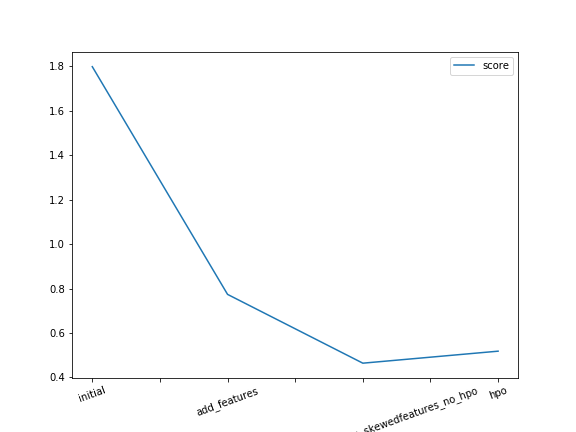

# Report: Predict Bike Sharing Demand with AutoGluon Solution
#### Mervat Khaled

## Initial Training
### What did you realize when you tried to submit your predictions? What changes were needed to the output of the predictor to submit your results?
As Kaggle doesn't accept negative values in submission files according to the evaluation metrics "RSMLE": which can be used if actual or predicted have zero-valued elements, but this function is not appropriate if either is negative valued. 
So I had to set those values to equal zero, fortunately, all values were positive, except one value in the last submission file.

Also, I couldn't run the commend line in the notebook to submit my submission files because I have different operating system!. so I took screen shots from kaggle submission page.

### What was the top ranked model that performed?
The top ranked model was: WeightedEnsemble_L3 with adding new features and defuelt setting "no hyperparameter tuning". 
The root squared error for the model = -19.36, R2/accuracy =0.988, kaggle score= 0.77367.

## Exploratory data analysis and feature creation
### What did the exploratory analysis find and how did you add additional features?

 #### Basic EDA:
 * Histograms:
Histograms depict that there are two features that look nearly normally distributed ["actual temp","temp"], whereas the target variable "count" is right skewed, also ["humidity and windspeed] are left and right-skewed. And skewed features should be transformed to be near to normal distribution before modeling because that affects on prediction.
 
* Some features were binary such as [holiday, working day]
* some features were categorical such as [season, weather].

 #### Additional EDA:
 
#### Heatmap to check correlation:

The heatmap graph illustrates that most of the features have poor correlation with each other and with the target value "count", although there are some features have highly correlated with each other such as ["atemp" and "temp", "month" and "season"], and we should drop one of them before modeling because that will cause multicollinearity which affects on the prediction. So I will drop the column "temp" because the column "atemp"\actual temperature gives us the same info, and also drop "month" because "season" has the same info.

Count and Hour have a moderate correlation. 

#### Lag plots to check the randomness and outliers on some features:

lag plots above show a linear pattern which means the data ["count","hour", "day", "month", "temp"] are strongly non-random which is not good for most of the statistical models because randomness is an underlying assumption for most statistical estimation and testing techniques.
there are some outliers, and they should be handeled. 

** Resources:

[1](https://www.itl.nist.gov/div898/handbook/eda/section3/eda33f.htm)
[2](https://www.itl.nist.gov/div898/handbook/eda/section3/lagplot2.htm)
[3](https://www.itl.nist.gov/div898/handbook/eda/section3/lagplot3.htm)

#### FacetGrid graphs:

* Facet grid graphs with classes in weather and season columns show how weather condition has a strong effect on rental bikes, therefore bikes rent most of the time in good weather whereas no rents in bad weather/class 4: "Heavy Rain + Ice Pallets + Thunderstorm + Mist, Snow + Fog" because logically people wouldn't sacrifice their lives and rent a bike in bad weather.

#### Line plot graphs:

* The line plot graphs with ["month", "season"] columns emphasize, what we have already observed with facet grid graphs, that weather has a huge effect on total rents, thus, bikes rent more in summer and fall.

*  With the "hour" column,  The line graph highlights that over time of the day, total rents are nonconstant, with 2 peaks around 8 am and between 5 pm and 6 pm.

#### Count of rows that have a zero value in the wind speed column:

* there are 1313 rows in train data and 867 in test data that have a zero value in the windspeed column, and maybe that occurs because of  = missing values or there is something wrong with acquiring data from the system. 

 
### How much better did your model preform after adding additional features and why do you think that is?
TODO: Add your explanation

## Hyper parameter tuning
### How much better did your model preform after trying different hyper parameters?
TODO: Add your explanation

### If you were given more time with this dataset, where do you think you would spend more time?
TODO: Add your explanation

### Create a table with the models you ran, the hyperparameters modified, and the kaggle score.
|model|hpo1|hpo2|hpo3|score|
|--|--|--|--|--|
|initial|?|?|?|?|
|add_features|?|?|?|?|
|hpo|?|?|?|?|

### Create a line plot showing the top model score for the three (or more) training runs during the project.

TODO: Replace the image below with your own.

### Create a line plot showing the top kaggle score for the three (or more) prediction submissions during the project.

TODO: Replace the image below with your own.

## Summary
TODO: Add your explanation
